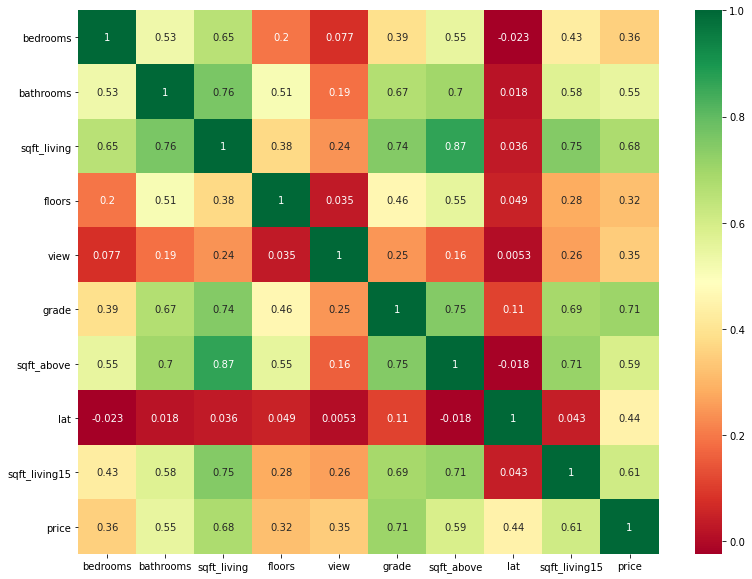
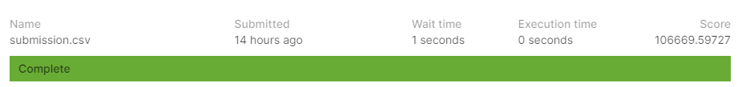

# aiffel_E05
Exploration_5, Get a good score in 2019 2nd ML month with KaKR (House Price Prediction)  
2019 2nd ML month with KaKR (House Price Prediction)에서 높은 점수 받기.  
[2019 2nd ML month with KaKR](https://www.kaggle.com/c/2019-2nd-ml-month-with-kakr).
  
  
## 개요
- hyper parameters tuning    
    본 시스템은 크게 3가지 단계로 이루어져 있습니다.
    1. Data pre-processing  
        - /data에 있는 데이터를 가져옵니다.
        - str를 int로 변환합니다.
        - 치우쳐있는 데이터를 log변환합니다.
        - data split(train, validation)
    2. learning  
        -데이터를 XGBRegressor를 통해 학습합니다.  
        -my_GridSearch를 통해 hyper parameters를 바꿔줍니다.
    3. result save  
        -가장 좋았던 hyper parms를 json파일로 저장합니다.

- 테스트하기    
    본 시스템은 크게 4가지 단계로 이루어져 있습니다.
    1. Data pre-processing  
        - /data에 있는 데이터(hyper parms, train, test)를 가져옵니다.
        - str를 int로 변환합니다.
        - 치우쳐있는 데이터를 log변환합니다.
        - data split(train, validation)
    2. learning  
        -XGBRegressor에 가장 좋았던 hyper parms를 적용합니다.  
        -train 데이터를 XGBRegressor를 통해 학습합니다.  
    3. test  
        -학습된 XGBRegressor에 test data를 통해 결과를 얻습니다.  
    4. result save  
        -결과를 kaggle의 데이터형태로 저장합니다.


## Installation
파이썬 개발 환경으로 최신 버전의 Anaconda를 설치하세요. (Python3 버전용)
* numpy
* pandas
* sckit-learn
* XGBRegressor

```
$ pip install -r requirements.txt
```

------------
## Directory
필수 디렉토리는 다음과 같습니다
```
.
├── data/
│   ├── train.csv
│   ├── test.csv
│   ├── test.csv
│   └── sample_submission.csv
├── hyper_params_tuning.py
├── [E-05]kaggle_House_price.ipynb
└── [E-05]kaggle_House_price.py
```

------------
### Error value according to model
| model | RMSE |
| --- | --- |
| GradientBoostingRegressor | 128370.486911 |
| RandomForestRegressor | 125228.641553 |
| LGBMRegressor | 111906.268088 |
| XGBRegressor | 110319.724637 |
- 기본적으로 XGBRegressor의 error값이 가장 작으므로 XGBRegressor모델을 통해 hyper parms를 변경합니다.   

-----
### Error value according to data correlation
    

    
| model | RMSE |
| --- | --- |
| GradientBoostingRegressor | 164387.980925 |
| RandomForestRegressor | 163202.901451 |
| LGBMRegressor | 160474.307734 |
| XGBRegressor | 158460.715008 |
- 결과값과 연관성이 높은 데이터를 통해 학습해봤지만 오히려 error값이 증가했습니다.     
- 데이터에 대한 전처리는 log변환만 사용했습니다.      

-----
### hyper parms tuning
    
```
param_grid = {
 'objective': ['reg:squarederror'],
 'base_score': [None],
 'booster': [None],
 'colsample_bylevel': [None],
 'colsample_bynode': [None],
 'colsample_bytree': [0.5, 0.6, 0.7, 0.8, 0.9, 1],
 'enable_categorical': [False],
 'gamma': [0, 1, 2, 3, 4, 5],
 'gpu_id': [0],
 'importance_type': [None],
 'interaction_constraints': [None],
 'learning_rate': [0.4, 0.3, 0.2 ,0.1, 0.05, 0.03, 0.01],
 'max_delta_step': [None],
 'max_depth': [3, 4, 5, 6, 7, 8, 9, 10],
 'min_child_weight': [None],
 'monotone_constraints': [None],
 'n_estimators': [100, 200, 300, 400, 500, 600, 700, 800],
 'num_parallel_tree': [None],
 'predictor': [None],
 'random_state': [None],
 'reg_alpha': [None],
 'reg_lambda': [None],
 'scale_pos_weight': [None],
 'subsample': [0.6, 0.7, 0.8, 0.9, 1],
 'tree_method': [None],
 'validate_parameters': [None],
 'verbosity': [None]
}
```
- 다음의 hyper parm를 수정해 최상의 결과를 도출한 결과를 얻었습니다.  
- hyper parms값을 json파일로 저장합니다.  
  
### result




------------
## Reference
1. [xgboost hyper parms](https://towardsdatascience.com/xgboost-fine-tune-and-optimize-your-model-23d996fab663)
2. [data correlation](https://velog.io/@jaehyeong/Kaggle-%EB%B3%B4%EC%8A%A4%ED%84%B4-%EC%A3%BC%ED%83%9D-%EA%B0%80%EA%B2%A9-%EC%98%88%EC%B8%A1House-Prices-Advanced-Regression-Techniques#2-feature-selection---variables-of-corrleation--03)